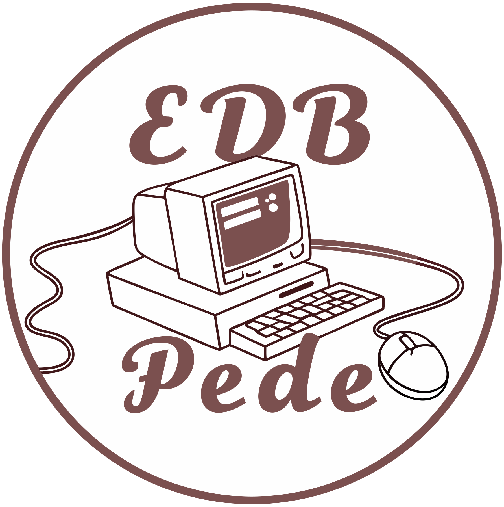

# Velkommen!

## Hej til alle besøgende!

Her vil være en samling af forskellige guides af instrukser, som har at gøre med det daglige arbejde som lærer i Ishøj / Strandgårdskolen. Årsagen til hjemmesiden er simpelthen fordi, at alle de beskeder jeg sender ud på Aula, på et eller andet tidspunkt fordufter eller går tabt blandt alt muligt andet.

## Oversigt

### Loginproblemer

* [Guide: Den "bedste" måde at logge ind på (i Ishøj Kommune)](loginproblemer/den-bedste-made-at-logge-ind-pa.md)

### Google Drev

* [Oversigt: Guides til Google Drev](google-drev/oversigt/)
  * [Generelt](google-drev/oversigt/generelt/)
    * [Hvordan deler jeg dokumenter? (med udefrakommende)](google-drev/oversigt/generelt/hvordan-deler-jeg-dokumenter.md)

### Meebook

* [Guide: Kopiere meddelelsesbog til nyt skoleår](meebook/kopiere-meddelsesbog-til-nyt-skolear.md)

### OS2faktor

* [Guide: Få OS2faktor til din Chromebook](os2faktor/fa-os2faktor-til-din-chromebook.md)
* [Guide: Hvordan bruger jeg OS2faktor?](os2faktor/hvordan-bruger-jeg-os2faktor.md)
* [Guide: Hvordan fjerner jeg gamle enheder fra OS2faktor?](os2faktor/hvordan-fjerner-jeg-gamle-enheder-fra-os2faktor.md)

### Skift af koder

* [Guide: Skifte koder på Uni-login](skift-af-koder/sadan-skifter-du-kode-pa-uni-login.md)
* [Guide: Skifte koder på meddel.dk (til Chromebooks](skift-af-koder/sadan-skifter-du-kode-pa-meddel.dk-til-chromebooks.md)[)](skift-af-koder/sadan-skifter-du-kode-pa-meddel.dk-til-chromebooks.md)
* [Guide: Skifte kode på min egen konto (til Chromebooks)](skift-af-koder/sadan-skifter-du-din-egen-kode-pa-din-chromebook.md)

### Skoletube

* [Oversigt: Guides til Skoletube](skoletube/oversigt/)
