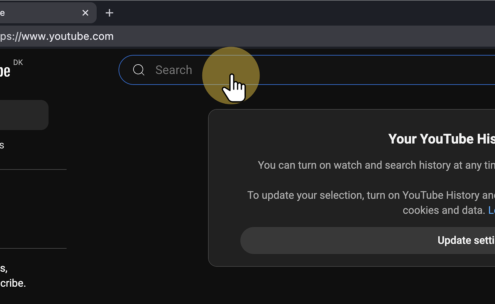

# Sådan kan du stadig se YouTube

## YouTube Links Guide

1. Søg på den video du **gerne vil se**

<figure><figcaption></figcaption></figure>

2. Find din video, og **højre-klik**

<figure><figcaption></figcaption></figure>

3. Vælg **"Kopier linkadresse"**

<figure><figcaption></figcaption></figure>

4. Tryk på **"Ny fane"-ikonet**

<figure><figcaption></figcaption></figure>

5. Tryk på "Adresse og søgelinjen", og indtast "**yt.edbpede.net**"

<figure><figcaption></figcaption></figure>

6. Indsæt **dit link**

<figure><figcaption></figcaption></figure>

7. Tryk på **"Konverter og Åbn"**

<figure><figcaption></figcaption></figure>

8. Vent et øjeblik...

<figure><figcaption></figcaption></figure>

9. Du kan nu se din Youtube-video :heart\_eyes:

<figure><figcaption></figcaption></figure>

