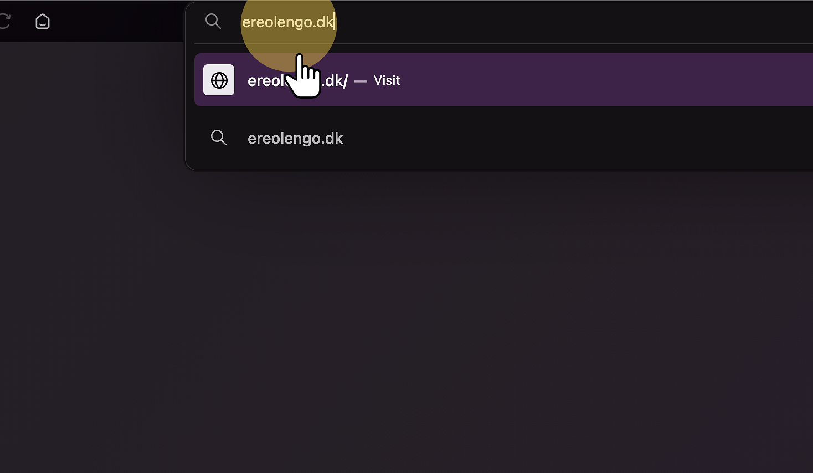
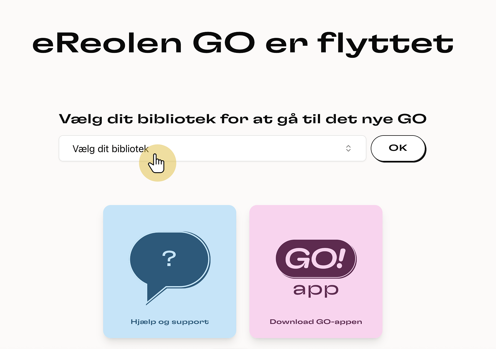
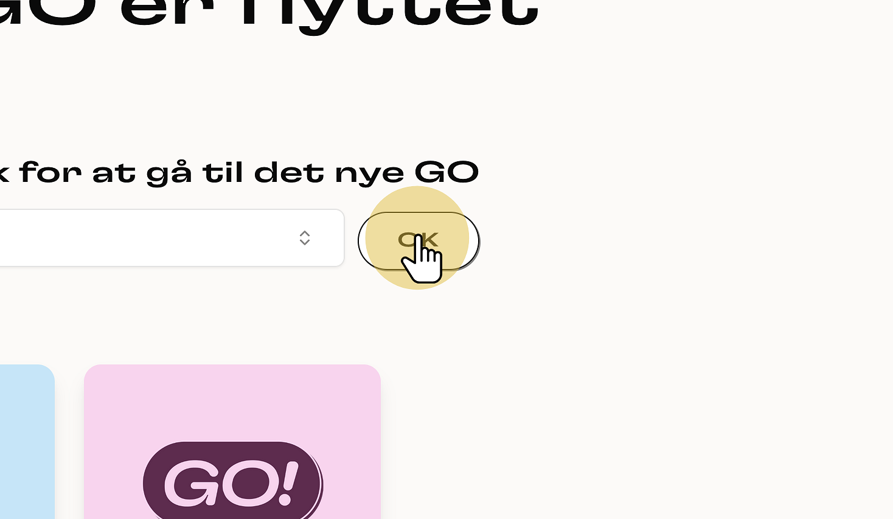
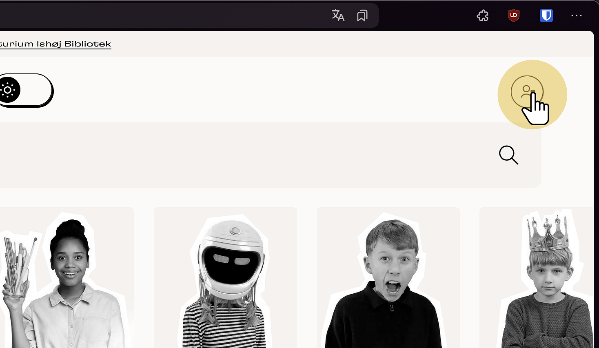
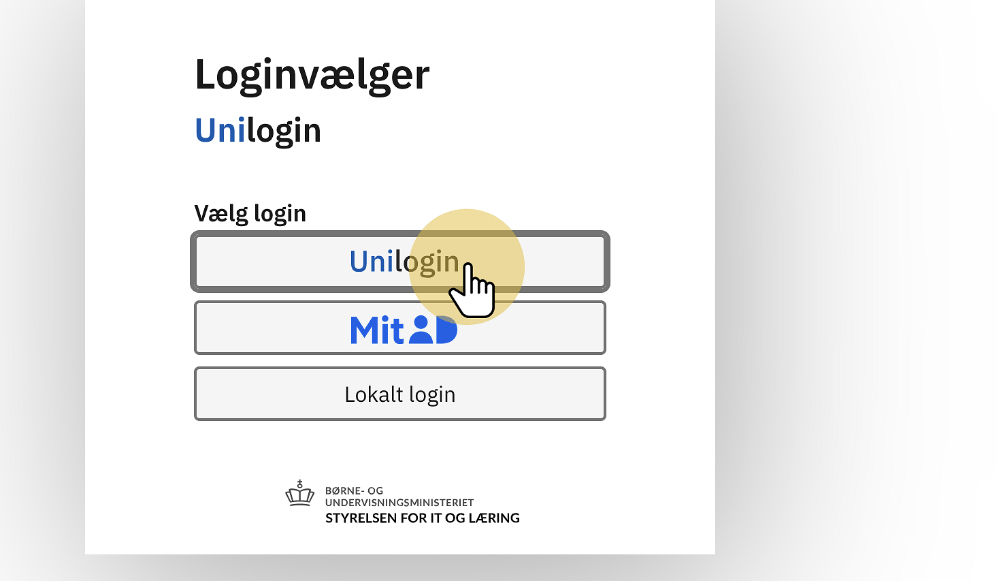
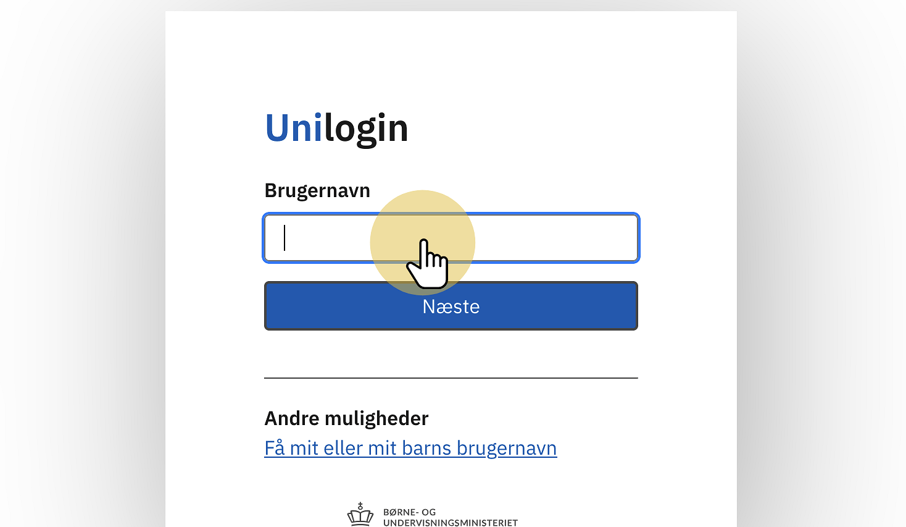
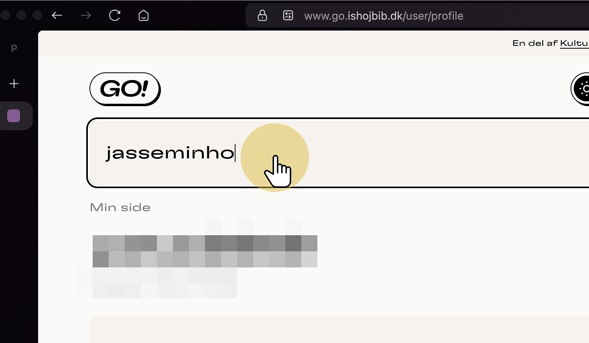
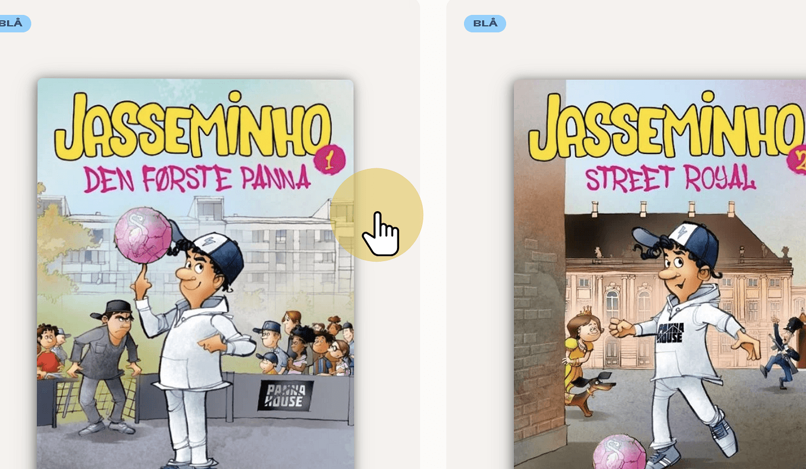

# Sådan logger du på den nye eReolenGO!

## eReolenGO! Instruks

#### 1. Tryk på på URL-bar'en

<figure><figcaption></figcaption></figure>

#### 2. Indtast "ereolengo.dk"

<figure><figcaption></figcaption></figure>

#### 3. Tryk på "Vælg dit bibliotek"

<figure><figcaption></figcaption></figure>

#### 4. Vælg "Ishøj Bibliotek"

<figure><figcaption></figcaption></figure>

#### 5. Tryk "OK"

<figure><figcaption></figcaption></figure>

#### 6. Tryk på ikonet her, for at logge ind

<figure><figcaption></figcaption></figure>

#### 7. Tryk "Log ind"

<figure><figcaption></figcaption></figure>

#### 8. Tryk på "Unilogin"

<figure><figcaption></figcaption></figure>

#### 9. Skriv dit brugernavn og log ind

<figure><figcaption></figcaption></figure>

#### 10. Tryk i søgefeltet

<figure><figcaption></figcaption></figure>

#### 11. Skriv en titel på en bog

<figure><figcaption></figcaption></figure>

#### 12. Tryk på bogen du vil læse!

<figure><figcaption></figcaption></figure>
