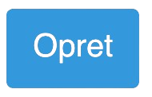

# Hvordan deler jeg dokumenter?

I Ishøj Kommune er Google Drev sat op således, at deling af dokumenter som standard foregår iblandt andre i kommunen, og dem der ellers er tilknyttet en **meddel.dk** konto.

Men man kan sagtens dele dokumenter med udefrakommende alligevel. Det kræver bare lidt ekstra trykkeri, når man skal dele sit dokument.

### Hvordan deler jeg mit dokument med udefrakommende?

Her er en kort instruks i, hvordan du deler et dokument med en, som ikke er tilknyttet Ishøj Kommune, eller som har en **meddel.dk** konto.

1. Gå ind i dit dokument, sheet, eller hvad du gerne vil dele
2. Tryk på &#x20;
3. Vælg 
4. Vælg 
5. Der vil nu komme et vindue frem, hvor du kan ændre dine delingsindstillinger
6. Under "**Generel adgang**", tryk på "**Begrænset**" og vælg "**Alle med linket**"

<figure><figcaption></figcaption></figure>

7. Som standard vælger den, at dem du vil dele med, kun kan **Læse** dit dokument. Det betyder, at dem du deler linket med, ikke kan redigere i dit dokument, men kun kan læse

<figure><figcaption></figcaption></figure>

8. Hvis man gerne vil give dem adgang til at redigere i dokumentet, vælg **Redaktør** i stedet for
9. Vælg om de skal have **Læser** eller **Redaktør** adgang
10. Tryk på for at kopiere det link, som du kan dele
11. Linket kan fx se således ud:\
    `https://docs.google.com/document/d/1e8MkOkBruYUsXxxXxxXDTUTXXXxzr3qlxMXxxbc/edit?usp=sharing`
12. Det er dét link, som du skal sende til dem du gerne vil dele dokumentet med.
