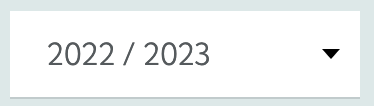
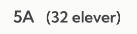
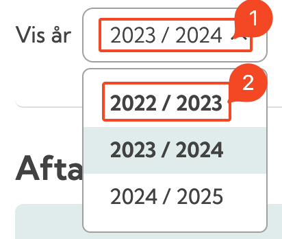

# Kopiere meddelsesbog til nyt skoleår

Her er en lille instruks til hvordan du kopierer en meddelelsesbog fra et skoleår til et andet.&#x20;

## Instruks:

1. Gå ind på [meebook.com](https://meebook.com/)
2. Tryk på knappen
3. Tryk på 
4. Log ind med dit UNI-Login eller meddel-konto
5. Når du er logget ind, tryk på 
6. Vælg det skoleår, du gerne vil kopiere fra, fx 
7. Vælg din årgang, fx 
8. Find elev, du gerne vil kopiere fra, fx 
9. Tryk på blyantsikonet, ud for deres navn: 
10. Husk at vælg det rigtige skoleår. Nogle gange vælger Meebook automatisk det nyeste skoleår.

11. For at kopiere meddelelsesbogen, skal du trykke på dette ikon: 
12. Vælg det skoleår, som du vil kopiere **til**. I dette tilfælde vælger jeg **2023/2024**.

13. Vælg den elev, du vil kopiere meddelelsesbogen til.

14. Tryk på knappen: 
15. Sådan! Du har nu kopieret meddelelsesbogen fra et skoleår, til et andet :)

