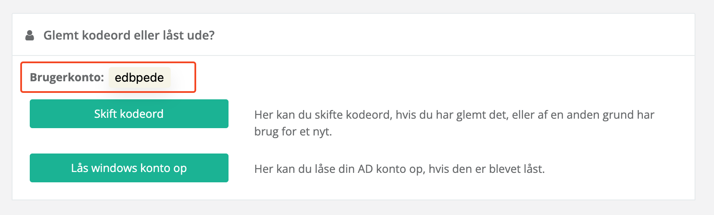

# Hvordan kommer jeg på ind min Chromebook?

### Velkommen til Strandgårdskolen!

Du har nu fået en Chromebook, men ved intet om, hvordan du kommer ind.

Når man bliver ansat i Ishøj Kommune, bliver du automatisk oprettet i Ishøj Kommunens lokale login (lokale IDP). I Ishøj Kommune hedder det "**@meddel.dk**".

#### Hvad er @meddel.dk, og hvad skal jeg bruge det til?

Din "@meddel.dk"-konto er typisk din adgangsbillet ind til de materialer, portaler og hvad end Strandgårdskolen har adgang til, og betaler for.

Du skal tænke det som en komplet erstatning for dit Unilogin. Det er to forskellige systemer.

For at kunne logge ind på den, skal du finde dit brugernavn, og oprette et kodeord.

#### Hvorfor kan jeg ikke bare bruge mit Unilogin? Det har jeg altid gjort!

Styrelsen for It og Læring (STIL) har valgt, at fra den 12. december 2024 [udfases Unilogin for alt personale](https://viden.stil.dk/display/OFFSKOLELOGIN/Udfasning+af+Medarbejdere+i+Unilogin+IdP) - også i Ishøj Kommune. Det vil sige, at man ikke længere kan bruge sit Unilogin som ansat.

#### Find dit brugernavn

For at finde dit brugernavn, følg denne instruktion:

1. Gå ind på [https://login.ishoj.dk](https://login.ishoj.dk/)
2. Tryk på 
3. Log ind med dit MitID, i mit tilfælde "**edbpede**"

<figure><figcaption></figcaption></figure>

4. Dit brugernavn vil fremgå her:

<figure><figcaption></figcaption></figure>

5. Mit brugernavn er altså "**edbpede**". Det er det jeg skal bruge, når jeg logger ind på min Chromebook.
6. Det vil også være din email. I mit tilfælde vil min email-addresse så være "**edbpede@meddel.dk**"

#### Hvordan laver jeg så min kode?

Du skal nu igang med den mest irriterende proces, at lave et stærkt kodeord. I Ishøj Kommune har de ret skrappe krav.

1. For at du kan skifte kode, skal du trykke på 
2. Du kan se kodeords-kravene under "**Regler for kodeordkompleksitet**"

<figure><figcaption></figcaption></figure>

3. For at opsummere kort:
   1. Dit kodeord skal være mindst 15 tegn langt. Der behøves **ikke** at være tal eller tegn.
   2. Det må ikke indeholde dit navn, fødeby, adresse, mor/fars/søskendes navn, osv.
   3. Det må ikke indeholde Æ, Ø, Å.
4. Jeg anbefaler typisk at lave sætninger, som dit kodeord, fx:
   1. "jeghaderatskiftekodeord"
   2. "jegkanikkelideminkode"
   3. og så videre...
5. Når du er klar, kan du give dig selv din nyde kode, ved at trykke på 

#### Hvordan logger jeg så på min Chromebook?

1. Åben din Chromebook, og indtast dit brugernavn (enten med eller uden "**@meddel.dk**").
2. Tryk på "**Næste**", og indtast dit nye kodeord
3. Du skulle nu logge ind, og Chromebook'en installerer et par enkelte standard-apps, som Ishøj Kommune har valgt skal være der (Geogebra, Google Chrome, osv).

### Jeg håber det virker, ellers skriv til mig (EDB Pede) på Aula!
