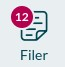

# Hvordan bruger jeg OS2faktor?

### Hvordan bruger jeg OS2faktor?

1. Du kan tjekke hvordan OS2faktor virker, ved fx at tilgå Aula's "sikre filer".
2. Start med at logge ind på [Aula](https://aula.dk) - husk at [brug din **@meddel.dk** konto](../loginproblemer/den-bedste-made-at-logge-ind-pa.md)!
3. Tryk derefter på "**Filer**": 
4. Tryk på "Gå til **Sikre filer**":

5. Den vil spørge, om du er sikker på, at du vil logge ind med et højere sikkerhedsniveau. Du trykker bare **JA**.

6. OS2faktor vil nu spørge, hvilken enhed du vil bruge. Vælg den vi har oprettet som "**Chromebook**":

7. Tast din **PIN** kode og vælg 

8. Sådan! Du har nu brugt din OS2faktor til at tilgå følsom data!

