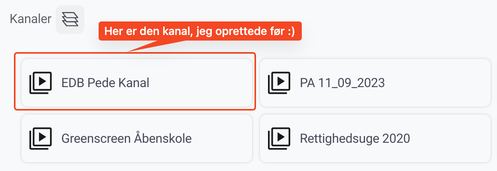

# Hvordan finder jeg min kanal?

### Hvordan finder jeg min kanal?

1. Når du har oprettet din kanal, kan du altid finde den igen, ved hjælp af [dette link](https://www.skoletube.dk/groups/listing)
2. Alternativt kan du gå til forsiden af [Skoletube](https://skoletube.dk)
3. Tryk på  og vælg 
4. Her vil højst sandsynligt være en masse kanaler, du ikke selv har oprettet, men som er delt med dig.
5. Find den kanal du lige har oprettet

<figure><figcaption></figcaption></figure>

6. Tryk på den, og så kan du bruge din kanal :thumbsup:

